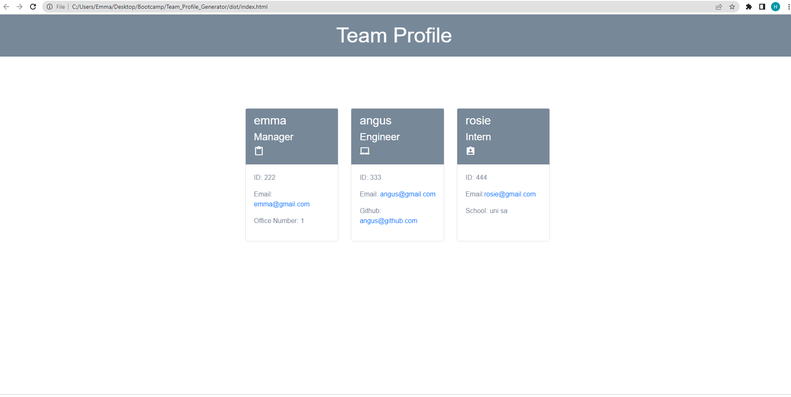

# Team Profile Generator 

## Description 
This application was created to generate a team profile based on user input using the Inquirer module from Node.js and displaying the information on a newly created html page with a style sheet. This project demonstrates use of OOP and TDD using Jest. 
 
## Table of Contents
* [Installation](#installation)
* [Usage](#usage)
* [License](#license)
* [Contributing](#contributing)
* [Tests](#tests)
* [Questions](#questions)

## Installation 
To use the application, clone the repository from GitHub and download NodeJS. This application also requires a file system and inquirer module. If testing is required, this application uses Jest. 

## Usage 
Use inquirer from your command line to answer questions about your project. Type "npm i && npm start" as a shortcut.
View walk through video here - [Screencastify](https://drive.google.com/file/d/1NsOI11j0p7ZNN6ndPOjOUYQE_PVwMYOZ/view?usp=sharing) 

## License 
This project uses MIT license

## Tests
Run `npm test` to run Jest for tests on constructors. 